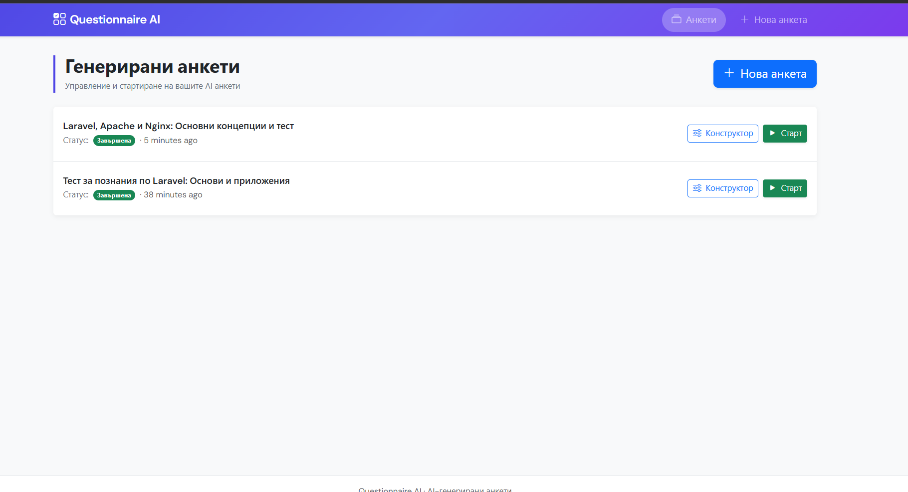
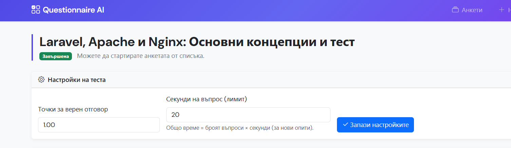
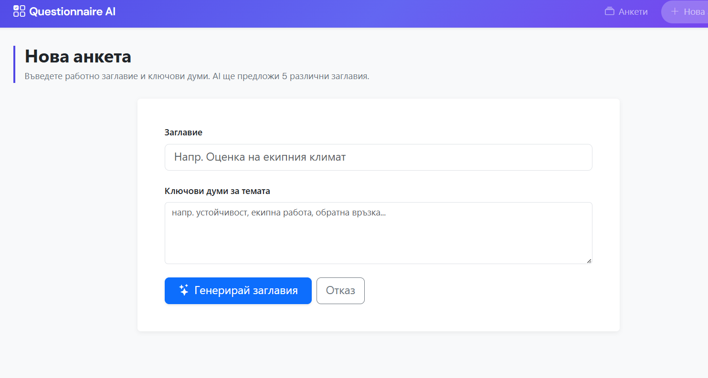
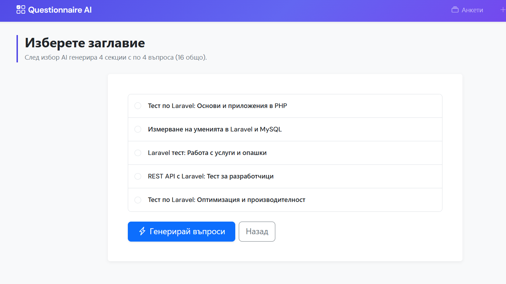
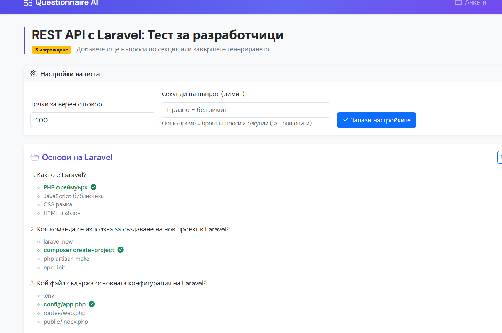
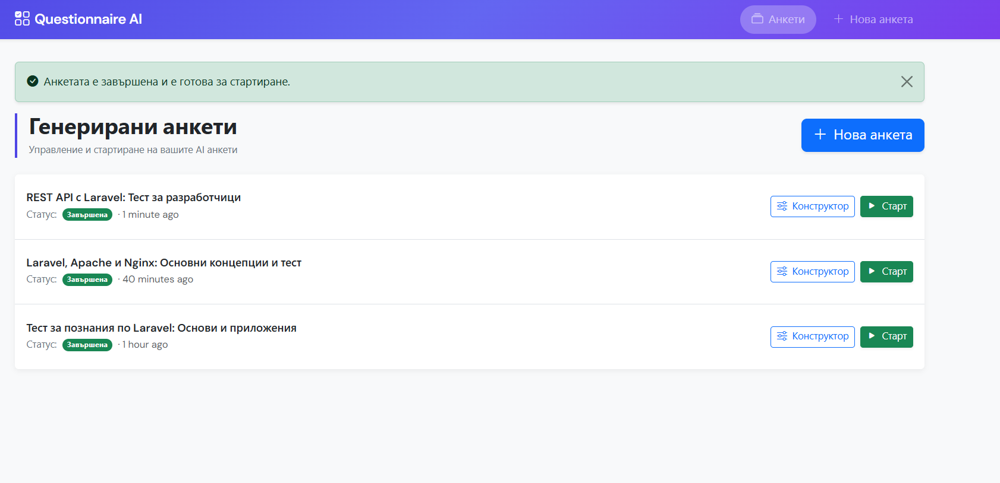

# Questionnaire AI

Уеб приложение на **Laravel 12** за създаване и провеждане на **тестове/анкети** с множествен избор. Текстовете и въпросите се **генерират с OpenAI (ChatGPT API)**; за всеки въпрос се записват **четири варианта на отговор** и **индекс на верния отговор** (за автоматично точкуване). Има **настройки за точки и времеви лимит**, **страница с резултат** след завършване и преглед на отговорите.

---

## Съдържание

- [Снимки от интерфейса](#снимки-от-интерфейса)
- [Изисквания](#изисквания)
- [Клониране от GitHub](#клониране-от-github)
- [Инсталация](#инсталация)
- [Конфигурация `.env`](#конфигурация-env)
- [База данни и миграции](#база-данни-и-миграции)
- [Стартиране](#стартиране)
- [Как работи приложението](#как-работи-приложението)
- [Генериране на анкета и въпроси](#генериране-на-анкета-и-въпроси)
- [Настройки на теста](#настройки-на-теста)
- [Попълване, време и резултат](#попълване-време-и-резултат)
- [Структура на проекта](#структура-на-проекта)
- [SSL / OpenAI под Windows](#ssl--openai-под-windows)
- [Тестове](#тестове)

---

## Снимки от интерфейса

Екранните снимки са в папка **`public/images/`** (`1.png` … `6.png`); в GitHub README се показват с относителни пътища по-долу.

| Файл | Описание (препоръчително съдържание на снимката) |
|------|--------------------------------------------------|
| `1.png` | Начален екран — списък с анкети |
| `2.png` | Форма „Нова анкета“ — заглавие и ключови думи |
| `3.png` | След създаване — успех, зареждане или преход към следващата стъпка |
| `4.png` | Избор между 5 AI-предложени заглавия |
| `5.png` | Конструктор — секции, въпроси, настройки, бутони |
| `6.png` | Попълване на тест или страница с резултат |













---

## Изисквания

| Компонент | Версия / бележки |
|-----------|-------------------|
| PHP | **8.2+** (Laravel 12; за Laravel 13 е нужен PHP 8.3+) |
| Composer | 2.x |
| Разширения PHP | `openssl`, `pdo`, `mbstring`, `tokenizer`, `xml`, `ctype`, `json`, `bcmath`, `curl` |
| Node.js (по избор) | за `npm run build` / Vite и Tailwind в assets |
| OpenAI | API ключ с достъп до избрания модел (по подразбиране `gpt-4o-mini`) |

---

## Клониране от GitHub

```bash
git clone git@github.com:sasho-krist/questionnaire_ai.git
cd questionnaire_ai
```

С **HTTPS**:

```bash
git clone https://github.com/sasho-krist/questionnaire_ai.git
cd questionnaire_ai
```

---

## Инсталация

### 1. Зависимости на PHP

```bash
composer install
```

### 2. Конфигурация на средата

```bash
copy .env.example .env
# Linux/macOS: cp .env.example .env
```

Редактирайте `.env` (вижте [Конфигурация `.env`](#конфигурация-env)).

### 3. Ключ на приложението

```bash
php artisan key:generate
```

### 4. База данни

Вижте следващата секция — SQLite или MySQL.

### 5. Миграции

```bash
php artisan migrate
```

### 6. Frontend (по избор)

```bash
npm install
npm run build
# или за разработка: npm run dev
```

Приложението работи и **само с Bootstrap от CDN** в Blade изгледите; Vite не е задължителен за основните страници.

---

## Конфигурация `.env`

### Задължително за AI

| Променлива | Описание |
|------------|----------|
| `AI_API_PUBLIC_KEY` | **Таен** API ключ от [OpenAI Platform](https://platform.openai.com/api-keys) (името в проекта е историческо; не е „публичен“ ключ). |
| `OPENAI_MODEL` | Модел за чат (по подразбиране `gpt-4o-mini`). |
| `OPENAI_VERIFY_SSL` | На Windows/WAMP при грешка `cURL error 60` сложете `false` само за локална разработка; в production използвайте `true` и настройте `curl.cainfo` в `php.ini`. |

### Приложение и URL

| Променлива | Пример |
|------------|--------|
| `APP_NAME` | `Questionnaire AI` |
| `APP_URL` | `http://localhost:8000` или вашият виртуален хост |

### База данни

**SQLite (по подразбиране в `.env.example`):**

```env
DB_CONNECTION=sqlite
```

Файлът `database/database.sqlite` се създава при първа миграция, ако липсва.

**MySQL:**

```env
DB_CONNECTION=mysql
DB_HOST=127.0.0.1
DB_PORT=3306
DB_DATABASE=questionnaire_ai
DB_USERNAME=root
DB_PASSWORD=
```

Създайте базата предварително (напр. `CREATE DATABASE questionnaire_ai ...`). В `AppServiceProvider` е зададено `Schema::defaultStringLength(191)` за съвместимост с utf8mb4 и индекси в MySQL.

### Сесии и опашки (Laravel по подразбиране)

За `SESSION_DRIVER=database` и `QUEUE_CONNECTION=database` са нужни миграциите на Laravel (включени в `php artisan migrate`).

---

## База данни и миграции

Основни таблици:

- `questionnaires` — анкета, статус, предложени заглавия, избрано заглавие, **`points_per_correct`**, **`seconds_per_question`**
- `questionnaire_sections` — секции
- `questionnaire_questions` — текст на въпрос, **`choice_options`** (JSON, 4 стринга), **`correct_option`** (0–3)
- `questionnaire_attempts` — опит за попълване, отговори (JSON), **`started_at`**, **`deadline_at`**, **`score`**, **`max_score`**, **`completed_at`**

Пълен reset на базата (изтрива данни):

```bash
php artisan migrate:fresh
```

---

## Стартиране

Вграден PHP сървър:

```bash
php artisan serve
```

Отворете `APP_URL` или `http://127.0.0.1:8000`.

Под **Apache** (WAMP) насочете **DocumentRoot** към папката **`public/`**.

---

## Как работи приложението

1. **Нова анкета** — въвеждате работно заглавие и ключови думи; AI генерира **5 заглавия**.
2. **Избор на заглавие** — избирате едно; AI създава **4 секции × 4 въпроса** (по 4 варианта на отговор); след допълнителна AI стъпка се записва **верният индекс** за всяко попълнение.
3. **Конструктор** — преглед на секции и въпроси; **настройки на теста**; „Още въпроси“ по секция; **Завърши генерирането** — анкетата става достъпна за стартиране.
4. **Старт** — нов **опит** с уникален URL `/play/{uuid}`.
5. **Попълване** — множествен избор; при зададен лимит — общ таймер; при изтичане — визуално оцветяване и блокиране на промени (при submit отговорите пак се изпращат).
6. **Завърши теста** — запис на резултат и пренасочване към **страница с резултат** и преглед на отговорите.

Идентификация на анкетата в URL е по **`uuid`**, не по числов `id`.

---

## Генериране на анкета и въпроси

| Стъпка | Маршрут / действие |
|--------|-------------------|
| Форма | `GET /questionnaires/create` → **Нова анкета** |
| Генериране на 5 заглавия | `POST /questionnaires` — извиква OpenAI, записва `title_suggestions` |
| Избор на заглавие | `GET/POST .../titles` — избор + генериране на **16 въпроса** в **4 секции** |
| Още въпроси | `POST .../generate-more` — още **4 въпроса** към избрана секция |
| Завършване на черновата | `POST .../finish` — статус `completed` |

Всички генерирани въпроси с множествен избор имат **точно 4 опции** и записан **`correct_option`** за точкуване.

---

## Настройки на теста

В **конструктора** (`GET /questionnaires/{uuid}/build`) има карта **„Настройки на теста“**:

| Настройка | Описание |
|-----------|----------|
| **Точки за верен отговор** | Колко точки се добавят за всеки верен множествен избор (напр. `1.00`). |
| **Секунди на въпрос (лимит)** | Ако е попълнено: общ лимит = **брой всички въпроси × секунди** (от старт на опита). Празно = без лимит. |

Запис: `POST /questionnaires/{uuid}/settings`.

Настройките важат за **нови опити** след промяна; вече завършени опити не се преизчисляват автоматично.

---

## Попълване, време и резултат

| Действие | Маршрут |
|----------|---------|
| Старт на нов опит | `GET /questionnaires/{uuid}/play/start` |
| Попълване | `GET /play/{attemptUuid}` — форма с радио бутони |
| Запазване | `POST /play/{attemptUuid}` — `mark_complete=0` запазва, `mark_complete=1` завършва |
| Резултат | `GET /play/{attemptUuid}/results` — точки, верни/грешни, вашият избор |

Точкуването сравнява избрания индекс (0–3) с **`correct_option`**. Въпроси без зададен верен отговор (стари данни) не участват в максималния резултат.

---

## Структура на проекта (важни файлове)

```
app/
  Http/Controllers/
    QuestionnaireController.php    # CRUD поток, настройки, генериране
    QuestionnairePlayController.php # опити, отговори, резултат
  Models/
    Questionnaire.php
    QuestionnaireSection.php
    QuestionnaireQuestion.php
    QuestionnaireAttempt.php
  Services/
    OpenAiService.php              # OpenAI Chat Completions + JSON
    AttemptScoringService.php      # изчисляване на score / max_score
config/services.php              # openai.key, model, verify_ssl
routes/web.php
resources/views/
  layouts/app.blade.php
  questionnaires/*.blade.php
database/migrations/
```

---

## SSL / OpenAI под Windows

При **`cURL error 60`** (SSL certificate problem):

1. В `.env`: `OPENAI_VERIFY_SSL=false` само локално, **или**
2. В `php.ini`: `curl.cainfo` и `openssl.cafile` към актуален `cacert.pem`.

`config/services.php` чете `OPENAI_VERIFY_SSL` и при `false` задава `verify => false` на HTTP клиента към OpenAI.

---

## Тестове

```bash
php artisan test
```

---

## Лиценз

Проектът следва лиценза на Laravel skeleton (**MIT**), освен ако не е указано друго.

---

## Автор и репозиторий

- **GitHub:** [sasho-krist/questionnaire_ai](https://github.com/sasho-krist/questionnaire_ai)

При проблеми с **push/SSH**: вижте `~/.ssh/config` без **UTF-8 BOM** (препоръчително записване с UTF-8 без BOM) и правилния `IdentityFile` за акаунта, който притежава хранилището.
